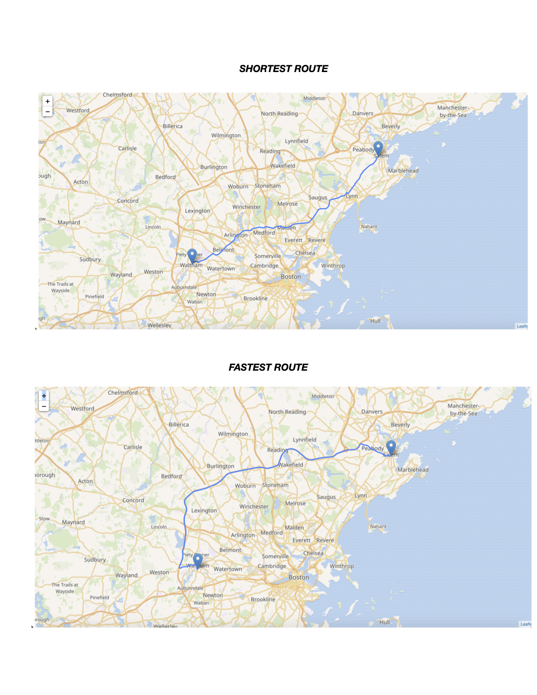

# boston_map

### Navigating Boston with Python: 

Implementation for the backend for a route-finding application, which finds **shortest path**, and **fastest path** between any two locations.

Uniform-cost search.

Map area: Cambridge/Boston (700 MB of data in OSM XML Format, from OpenStreetMap).

Map data is displayed via [leaflet](https://leafletjs.com/)

To try this tool, start the server by running server.py and providing name of the dataset (mit/midwest/cambridge) as argument. 

`python3 server.py cambridge`

After the server has successfully started, navigate to http://localhost:6009/ (http://localhost:6009/?type=fast if you want to search for fastest path instead) in your web browser. Simply double-clicking on two locations to find and display a shortest path between them.

